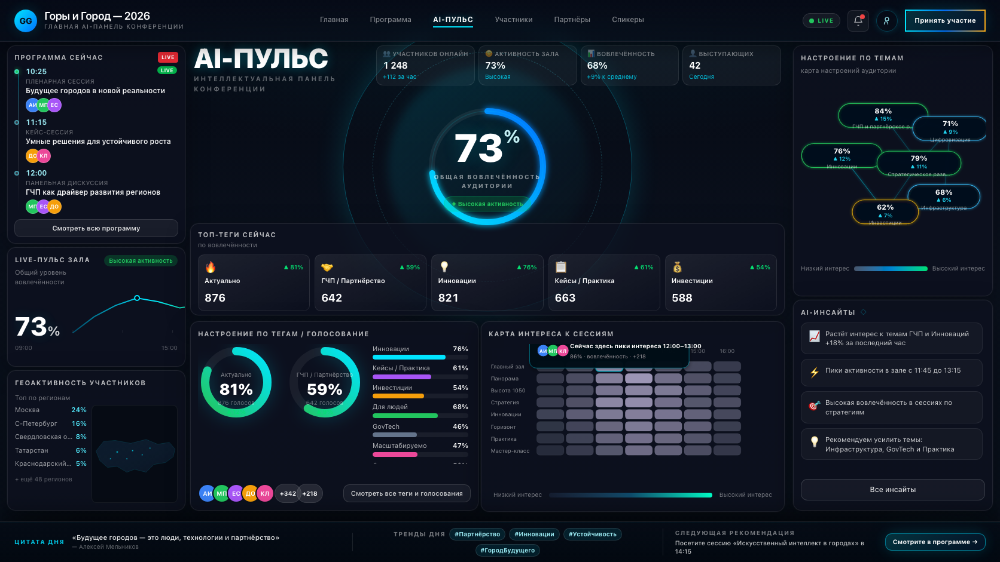

# PULSE — Phase 1 manual review package

**Дата пакета:** 2026-05-13 (обновлено после **Pixel-Fix Iteration 5**).  
**Режим:** только **Phase 1** (статический `/pulse`, mock). **Не** Phase 2 / Phase 3.  
**Статус gate:** Phase 1 **пока не закрыт** — ожидается ручной visual review после Iteration 5.  
**Запрещено в рамках текущего gate:** Firebase, ECharts, подключение `/pulse/vote` как продуктового потока.

Этот файл — **единая точка входа** для ручного visual approval. Остальные документы — приложения.

**Главный actual UI после Iteration 5 (источник копии):** `docs/PULSE_CHECKPOINT_actual.png` — снимок `.pulse-stage` с `/pulse?visualTest=1` **без** `overlay=1` (чистый UI, не reference, не diff, не review sheet).

FINAL CANDIDATE PNG:  
`docs/PULSE_FINAL_CANDIDATE_ITER5.png`

Reference image:  
`public/reference/pulse-target.png`

Review sheet:  
`docs/PULSE_VISUAL_REVIEW_SHEET.png`

Diff:  
`docs/PULSE_CHECKPOINT_diff_vs_reference_scaled.png`

`docs/PULSE_FINAL_CANDIDATE_ITER5.png` — байт-в-байт копия `docs/PULSE_CHECKPOINT_actual.png` на момент фиксации финального кандидата для ручного review.

---

## 1. Actual screenshot (чистый UI)

| Что | Путь |
|-----|------|
| **Checkpoint (для diff и review sheet)** | [`docs/PULSE_CHECKPOINT_actual.png`](PULSE_CHECKPOINT_actual.png) |
| **Финальный кандидат (копия для sign-off)** | [`docs/PULSE_FINAL_CANDIDATE_ITER5.png`](PULSE_FINAL_CANDIDATE_ITER5.png) |
| **Playwright baseline (регрессия)** | `tests/pulse.visual.spec.ts-snapshots/pulse-stage-chromium-darwin.png` |



**Как снято:** viewport **1672×941**, `reducedMotion`, URL `/pulse?visualTest=1` (без `overlay`). Область: `.pulse-stage`.

**Обновить артефакты:** `npm run test:visual` (при смене визуала — `npm run test:visual:update` → snapshot **technical / non-final** до sign-off) → скопировать snapshot в `docs/PULSE_CHECKPOINT_actual.png` → scaled ref + `node scripts/pulse-ref-diff.cjs` + `npm run docs:pulse-sheet`.

---

## 2. Review sheet

| Что | Путь |
|-----|------|
| **Сводная полоса:** scaled ref, actual, rough diff, blend ~0.18, 9 пар crop ref/actual по зонам | [`docs/PULSE_VISUAL_REVIEW_SHEET.png`](PULSE_VISUAL_REVIEW_SHEET.png) |


**Генерация:** `npm run docs:pulse-sheet` (`scripts/build-pulse-review-sheet.cjs`).

**Overlay (только alignment):** `/pulse?visualTest=1&overlay=1` — см. [`docs/PULSE_VISUAL_DIFF_REPORT.md`](PULSE_VISUAL_DIFF_REPORT.md). *Overlay mode is for alignment only, not for visual approval.*

---

## 3. Component gaps

| Документ | Назначение |
|----------|------------|
| [`docs/PULSE_COMPONENT_GAPS.md`](PULSE_COMPONENT_GAPS.md) | Матрица отличий vs reference + секция **Iteration 4–5** (atmosphere / cinematic). |

Дополнительно: [`docs/PULSE_LAYOUT_MAP.md`](PULSE_LAYOUT_MAP.md), [`docs/PULSE_VISUAL_DIFF_REPORT.md`](PULSE_VISUAL_DIFF_REPORT.md).

---

## 4. Зоны: PASS / NEEDS FIX / CRITICAL

Оценка после **Iteration 3** (композиция), **4–5** (atmosphere + cinematic depth). Композиция и порядок блоков **не менялись**.

### PASS

| Зона | Комментарий |
|------|-------------|
| **Глобальная сетка** | 1672×941, позиции блоков — принятая база. |
| **Cinematic background** | `pulse-atmosphere.svg` (усилен), **`pulse-city-mountains.svg`**, `.pulse-stage-panorama`, horizon wash, затемнение центра для читаемости. |
| **Hero depth** | Двойной backdrop, 520px орбиты, **hgCore**, path-дуги, усиленное кольцо 73%. |
| **Premium glass (панели)** | Blur 26px, lateral inset cyan/gold, токены краёв и glass stack. |
| **Нижняя сцена** | `.pulse-mountain-footer` усилен; футер: skyline **34px**, city glow, glass bar. |
| **Topic mood (декор)** | Mesh, weak edges, sparks, **sparkWeb**; **LAYOUT** узлов без изменений. |
| **Регрессия** | `npm run build` + `npm run test:visual` — зелёные после Iteration 5. |

### NEEDS FIX

| Зона | Суть |
|------|------|
| **Топ-теги** | Emoji vs плоские иконки макета. |
| **Голосование / donuts** | Микродуги vs ref. |
| **Live зал** | Текстура линии. |
| **Heatmap** | Ячейки / tooltip. |
| **Гео** | Силуэт vs иллюстрация. |
| **AI-инсайты** | Низкий приоритет. |

### CRITICAL

| ID | Статус |
|----|--------|
| **C1** | **Остаётся** — только upscaled ref; rough diff **~21.14%** advisory, не критерий approval. |
| **C2** | **Остаётся** — ручной sign-off Phase 1 после просмотра actual + sheet. |

---

## 5. Рекомендация: закрывать Phase 1?

| Исход | Условие |
|-------|---------|
| **Можно закрывать Phase 1** | Ревьюер подтверждает, что cinematic / premium depth **достаточны**; NEEDS FIX принимается как долг до native ref или отдельного **контентного** polish (не Phase 2). |
| **Продолжить polish** | Нужна доводка виджетов из NEEDS FIX — отдельная итерация по gaps, **не** смена фазы продукта. |

**Итог:** Iteration 5 закрывает запрос на **«Горы и Город»**, горизонт и **premium depth**. Phase 1 **всё ещё открыт** до явного ручного решения (**C2**).

---

## Команды верификации

```bash
npm run build
npm run test:visual
npm run docs:pulse-sheet
node scripts/pulse-ref-diff.cjs docs/PULSE_REFERENCE_scaled_1672.png docs/PULSE_CHECKPOINT_actual.png docs/PULSE_CHECKPOINT_diff_vs_reference_scaled.png
```
